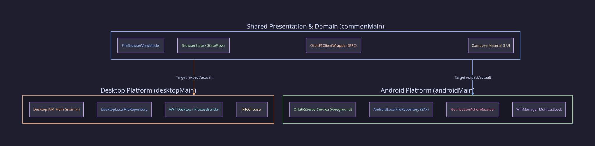
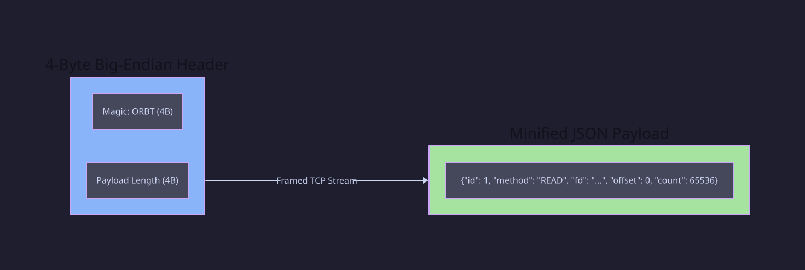

# OrbitFS Client — Cross-Platform P2P File System & Local Orbit Network

> *"Your Data, in Local Orbit."*

[](https://kotlinlang.org/docs/multiplatform.html)
[](https://www.jetbrains.com/lp/compose-multiplatform/)
[](#building--running)
[](LICENSE)

OrbitFS Client is a privacy-first, local-only, high-bandwidth peer-to-peer file sharing application engineered for **Android** and **Desktop (macOS, Windows, Linux)**. Built using **Kotlin Multiplatform (KMP)** and **Compose Multiplatform (CMP)**, OrbitFS operates completely independent of cloud servers, third-party proxies, and internet routing—delivering line-rate file streaming and sub-millisecond latencies across local area networks (LAN/WLAN).

---

## 📚 Table of Contents

- [Key Features Overview](#-key-features-overview)
- [Architecture & Tech Stack](#%EF%B8%8F-architecture--tech-stack)
- [Low-Level Design (LLD) Summary](#-low-level-design-lld-summary)
- [Repository Structure](#-repository-structure)
- [Installation & Build Guide](#-installation--build-guide)
- [Documentation Index](#-documentation-index)
- [License](#-license)

---

## 🌟 Key Features Overview

Below is a brief summary of OrbitFS Client capabilities. For in-depth technical documentation, visit [docs/FEATURES.md](docs/FEATURES.md).

- **Dual-Role Satellite Node Architecture**: Operates as both an active file explorer client and a background satellite file server on every device.
- **Custom Binary-Framed RPC Protocol**: Length-prefixed 4-byte big-endian JSON framing protocol over TCP (`READ`, `WRITE`, `STAT`, `LIST`, `OPEN`, `CLOSE`).
- **Zero-Config UDP Radar Discovery**: UDP broadcast beacons (Port 9999) with Android `MulticastLock` and dead-man timer stale-peer pruning.
- **Ghost Launcher Runtime Interop**: Executes Java 21 server instances inside Android ART using `sun.misc.Unsafe` reflection desugaring patches.
- **Strict Sandbox Path Canonicalization**: `SandboxGuard` canonical path validation prevents directory traversal security vulnerabilities.
- **Advanced Transfer Engine**:
  - Live bandwidth speed calculation (`KB/s`, `MB/s`) using time-delta sampling.
  - Ongoing system notification progress syncing with instant **Cancel / Stop Download** actions.
  - Native **Show in Folder** / **Navigate to Location** support across Android SAF and macOS Finder (`open -R`).
  - Gesture-based `HorizontalPager` tab swiping for active and historical transfers.
- **Randomized Identity Generation**: Auto-generates unique Node IDs, space-themed Pilot Names, and Pilot Avatars on setup and profile reset.

---

## 🏗️ Architecture & Tech Stack

For full architectural patterns and threading details, see [docs/ARCHITECTURE.md](docs/ARCHITECTURE.md).



| Layer | Technologies & Frameworks |
|---|---|
| **Languages** | Kotlin, Java 21 |
| **Multiplatform UI** | Compose Multiplatform, Jetpack Compose, Material 3 Design |
| **Async & State** | Kotlin Coroutines, Flow, StateFlow, Channels |
| **Networking & Protocols** | Custom RPC over TCP Sockets, UDP Broadcast (Port 9999), DatagramSocket |
| **Runtime Interop** | `sun.misc.Unsafe` reflection patches, Java NIO, Storage Access Framework (SAF) |
| **Build & CI** | Gradle Kotlin DSL, GitHub Actions |

---

## 📐 Low-Level Design (LLD) Summary

OrbitFS uses a framed TCP socket protocol with 4-byte big-endian length headers. For full sequence diagrams and state machine specifications, see [docs/DESIGN.md](docs/DESIGN.md).



---

## 📁 Repository Structure

```
OrbitFS-Client/
├── composeApp/
│   ├── src/
│   │   ├── commonMain/      # Shared ViewModels, UI Screens, RPC Client Wrapper, Models
│   │   ├── androidMain/     # Android Foreground Service, SAF Repository, Notifications, MainActivity
│   │   └── desktopMain/     # Desktop JVM Launcher, AWT/ProcessBuilder Handlers, Desktop Repository
│   └── libs/
│       └── orbitfs-core-0.1.0.jar   # Core Pure-Java RPC & Transport Library
├── docs/                    # Detailed technical sub-documentation & D2 diagrams
│   ├── diagrams/            # D2-generated SVG architecture & sequence diagrams
│   ├── FEATURES.md          # Feature specification & capability list
│   ├── ARCHITECTURE.md      # System architecture & KMP patterns
│   ├── DESIGN.md            # Low-Level Design (LLD) & protocol spec
│   └── INSTALLATION.md      # Installation & build instructions
├── AGENT.md                 # Technical flight recorder and architectural journal
└── README.md                # Project README
```

---

## 🛠️ Installation & Build Guide

Quick build instructions. For full platform instructions, see [docs/INSTALLATION.md](docs/INSTALLATION.md).

### Prerequisites
- **JDK 21** or higher
- **Android SDK** (API Levels 26–35)
- **Gradle 8.x**

### Quick Commands

- **Build Android Debug APK:**
  ```bash
  ./gradlew :composeApp:assembleDebug
  ```
- **Install & Run on Android Device / Emulator:**
  ```bash
  ./gradlew :composeApp:installDebug
  ```
- **Run Desktop App (macOS / Windows / Linux):**
  ```bash
  ./gradlew :composeApp:run
  ```
- **Package Desktop Executable / JAR:**
  ```bash
  ./gradlew :composeApp:desktopJar
  ```

---

## 📑 Documentation Index

- [Feature Specification (docs/FEATURES.md)](docs/FEATURES.md)
- [System Architecture (docs/ARCHITECTURE.md)](docs/ARCHITECTURE.md)
- [Low-Level Design (docs/DESIGN.md)](docs/DESIGN.md)
- [Installation Guide (docs/INSTALLATION.md)](docs/INSTALLATION.md)
- [Technical Flight Recorder (AGENT.md)](AGENT.md)

---

## 📄 License
OrbitFS is distributed under the [Apache License 2.0](LICENSE).
