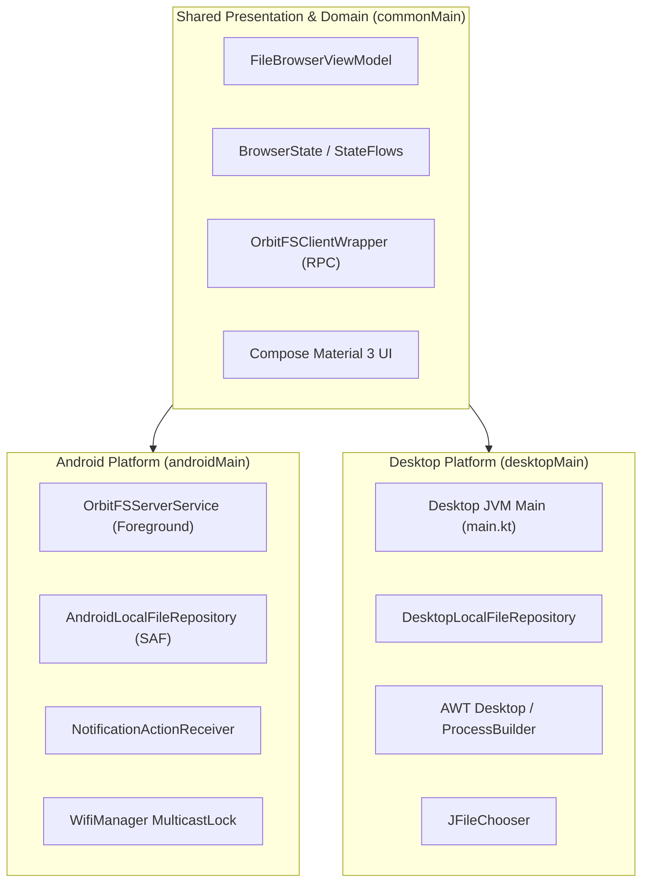

# OrbitFS Client — System Architecture & KMP Patterns

## 🏗️ High-Level System Architecture

OrbitFS is structured as a Kotlin Multiplatform (KMP) project that isolates core domain logic, presentation state machines, and RPC protocol handlers into `commonMain`, while providing native platform implementations in `androidMain` and `desktopMain`.

---

## 🧩 Core Architectural Components

### 1. `ConnectionManager`
Manages the TCP socket connection state machine (`Disconnected`, `Connecting`, `Connected`, `Error`).
- Retains reference to active `OrbitFSClientWrapper`.
- Dynamically updates client socket timeout and chunk buffer configuration (`updateCurrentConfig`) without tearing down existing UI sessions.
- Automatically handles reconnection and retry policies.

### 2. `OrbitFSClientWrapper`
Wraps the low-level `CachingOrbitFSClient` and `NetworkTransportClient`.
- Implements length-prefixed binary/JSON RPC commands (`list`, `readFile`, `streamFile`, `delete`).
- Enforces coroutine cancellation checks (`coroutineContext.ensureActive()`) during file streaming loops to allow immediate socket cancellation.

### 3. `FileBrowserViewModel`
Unifies presentation state across Android and Desktop platforms.
- Exposes `BrowserState` (current path, file items, loading states, sort orders, multi-select).
- Tracks `_downloadStates` (`FileDownloadState`) for active and historical file transfers.
- Computes time-delta sampling for real-time bandwidth speeds (`speedBytesPerSecond`).
- Emits side-effects via `UiEffect` Channel (`OpenFile`, `ShareFile`, `OpenFolder`, `ShowToast`).

### 4. `LocalFileRepository` (`expect`/`actual`)
Platform abstraction interface for OS-level file I/O, cache management, and system notifications.
- **Android (`AndroidLocalFileRepository`)**: Interacts with Android Storage Access Framework (SAF), `FileProvider`, `NotificationManager`, and `NotificationActionReceiver`.
- **Desktop (`DesktopLocalFileRepository`)**: Interacts with JVM `File` handles, Swing `JFileChooser`, and native `ProcessBuilder` OS commands (`open`, `open -R`).

---

## 🔄 Concurrency & Threading Model

- **UI & Presentation**: Executes on `Dispatchers.Main` via Compose StateFlow collectors and coroutine scopes.
- **Networking & Socket I/O**: Executes on `Dispatchers.IO` using non-blocking Kotlin coroutines.
- **Socket Teardown on Cancel**: Invokes socket disconnect on `Dispatchers.IO` to unblock native Java `InputStream.read()` calls instantly when a user cancels a download.
