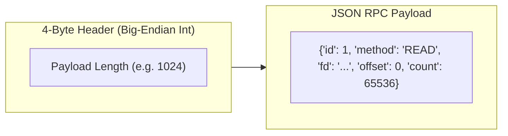
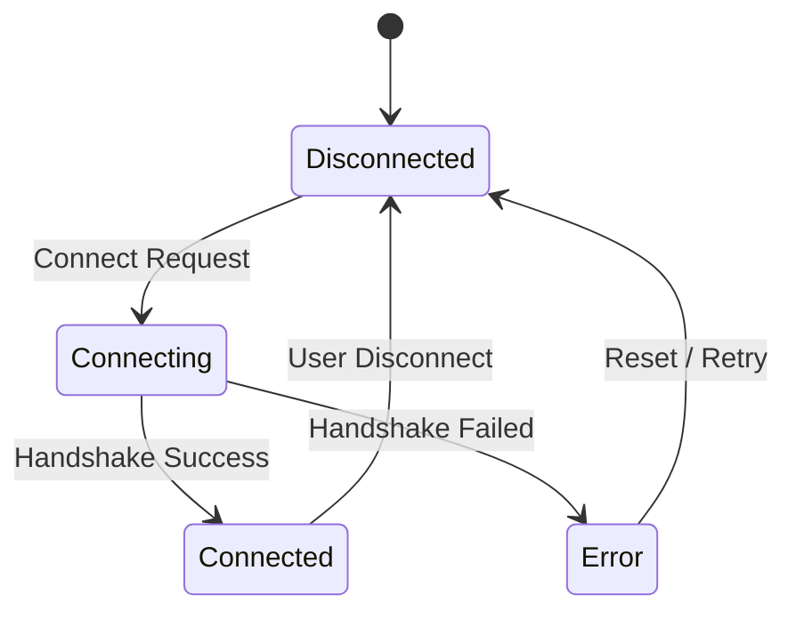
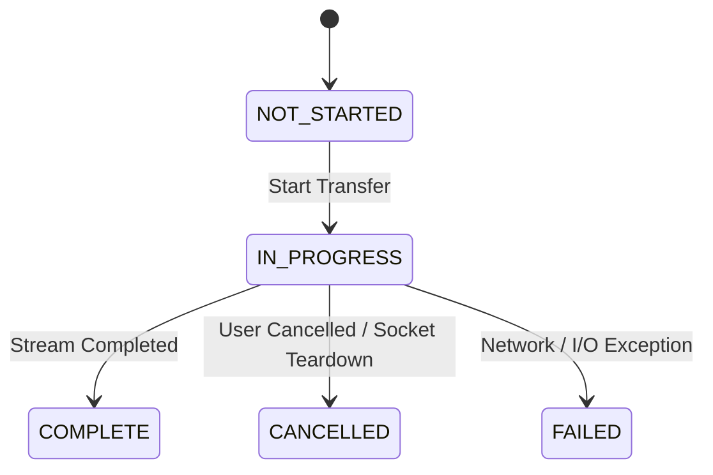
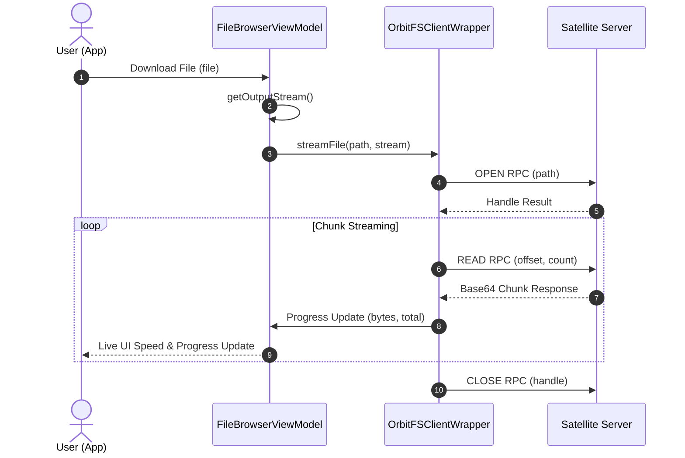

# OrbitFS Client — Low-Level Design (LLD)

## 📐 Low-Level Design Specification

### 1. RPC Message Framing & Socket Protocol

OrbitFS communicates over raw TCP sockets using a 4-byte length-prefixed binary header followed by a minified JSON command payload.



#### Protocol Opcodes / Methods:
- **`PING`**: Health check and round-trip latency measurement.
- **`OPEN`**: Validates remote path and returns a session file handle.
- **`LIST`**: Lists directory contents with metadata (`size`, `isDir`, `lastModified`, `extension`, `permissions`).
- **`READ`**: Reads raw file bytes at offset `N` up to count `C` (Base64 encoded).
- **`WRITE`**: Writes Base64 encoded payload to offset `N`.
- **`STAT`**: Returns file metadata and canonical sandbox check.
- **`CLOSE`**: Closes active file handles on server.

---

### 2. State Machine Diagrams

#### Connection Lifecycle


#### File Download State Machine


---

### 3. Data Transfer Sequence Diagram



---

### 4. Security & Path Canonicalization (`SandboxGuard`)

To protect the host device from malicious directory traversal attempts (`../../system/hosts`), all path requests pass through `SandboxGuard`:

```kotlin
fun resolveSafely(sandbox: SandboxGuard, rawPath: String?): Path {
    val input = rawPath?.trim() ?: ""
    if (input.isEmpty() || input == "/" || input == ".") return sandbox.root

    val relative = input.trimStart('/')
    val resolved = sandbox.root.resolve(relative).normalize()
    
    if (!resolved.startsWith(sandbox.root)) {
        throw SecurityException("Access outside sandbox forbidden")
    }
    return resolved
}
```

If any resolved path escapes `sandbox.root`, a `SecurityException` is thrown and the RPC request is aborted.
