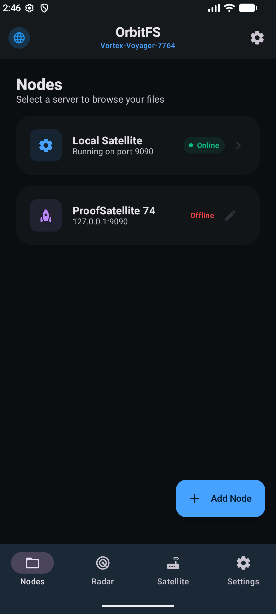
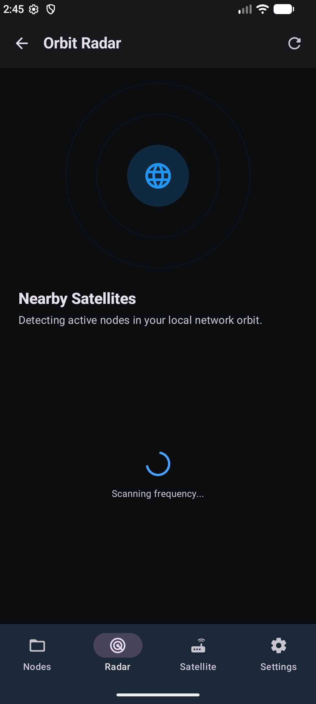
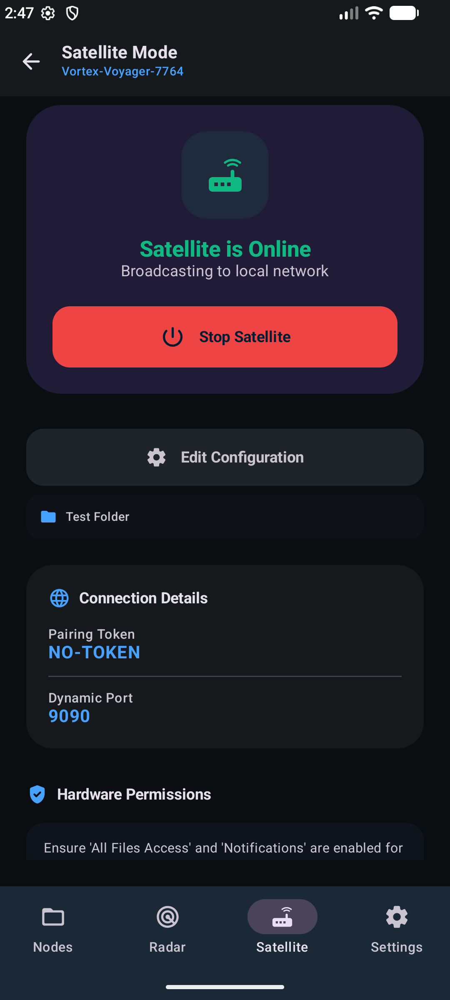
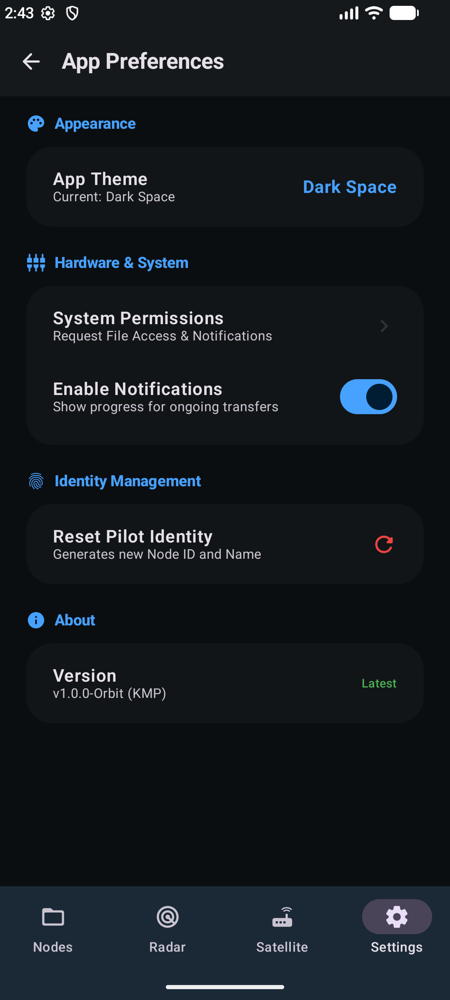

# OrbitFS Client — Dark Space UI & Screen Gallery

Below are live screenshots of OrbitFS Client rendered in **Dark Space** mode on Android.

---

## 📱 Visual Screen Tour

### 1. Node Hub Screen
The main landing hub showing saved server instances, connection health indicators, active pilot name, and quick-connect cards.

---

### 2. Orbit Radar Discovery
Zero-config UDP broadcast discovery on Port 9999 showing nearby active OrbitFS nodes, pilot avatars, and one-tap connection prompts.

---

### 3. Satellite Mode (Local Server)
On-demand local satellite server launcher with custom port selection, folder picker integration, and active status pill.

---

### 4. File Explorer Screen
High-performance file explorer supporting breadcrumb bar navigation, remote file streaming, multi-select operations, and sorting.

---

### 5. App Preferences & Settings
System settings covering App Theme selection (System Default, Light Orbit, Dark Space), notification preferences, and identity resets.

